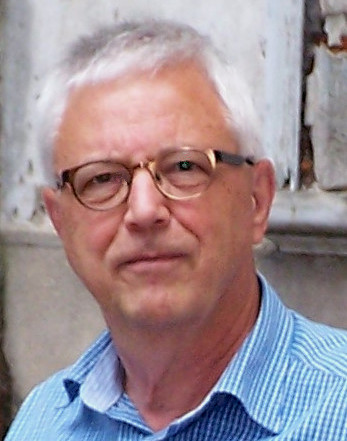
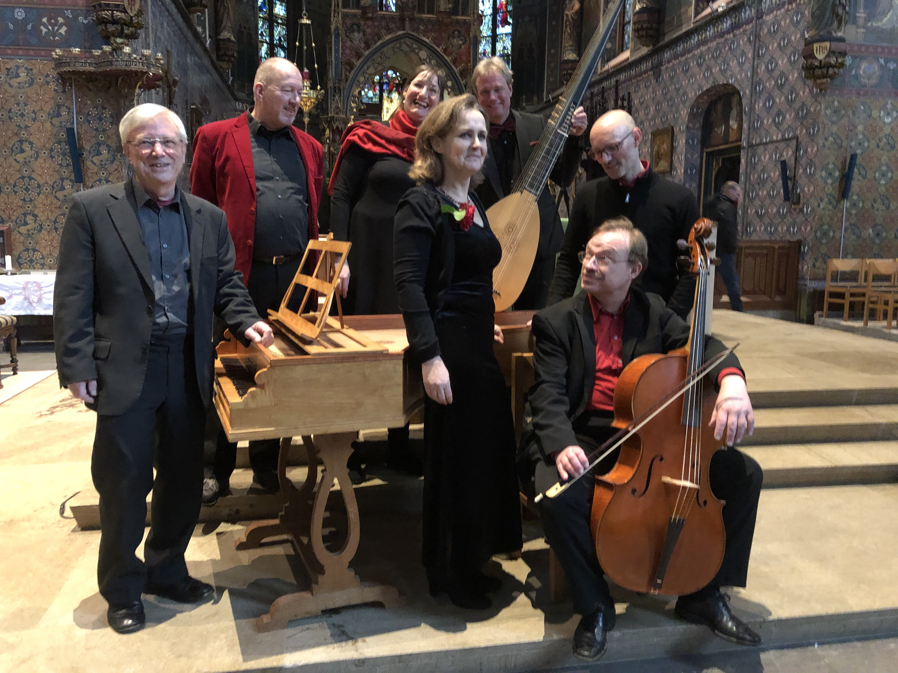
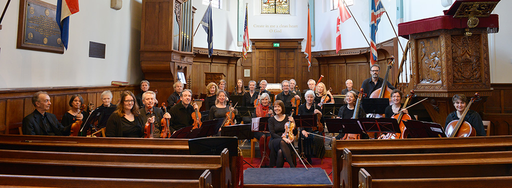
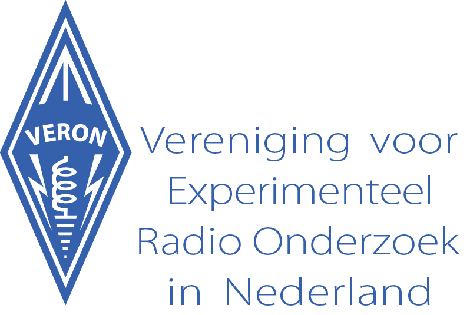
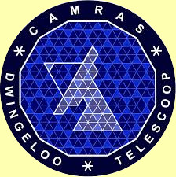

#  Tom Fossen

##  
 verbonden aan  :
 • emeritus-
predikant van de [ Protestantse Kerk in
Nederland](http://www.protestantsekerk.nl)   
• klavecinist/organist  
maakt deel uit van het ensemble [ 'Con Piacere'
](http://www.barokensembleconpiacere.nl)   
  
en van het [ 'Purcell Kamerorkest' ](http://www.purcellkamerorkest.nl)
  
Eerstvolgende concert: zo. 19 februari 2023, 15.15 u., Maarten Lutherkerk,
Dintelstraat 134/ingang Uiterwaardenstraat 279, Amsterdam  
  
 • zendamateur: PA2FZL

  
  
contact: tel.: 0652468584 - e-mail: tom@tomfossen.nl, tom@deluistering.nl en
pa2fzl@veron.nl **

